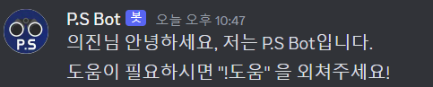
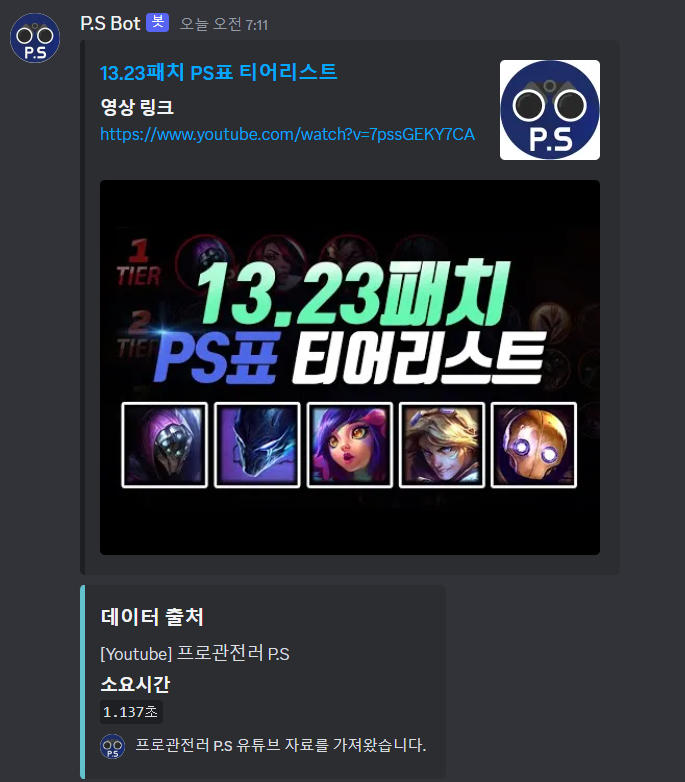

League of Legend `P.S Bot` </img>
=
카테고리
-
▶ [프로젝트 참여자](#-프로젝트-참여자)

▶ [프로젝트 동기 & 설명](#-프로젝트-동기--설명)

▶ [P.S 봇 사용법 & 기능 - 사용자](#-ps-봇-사용법--기능---사용자)

▶ [P.S 봇 사용법 - 개발자](#-ps-봇-사용법---개발자)

▶ [사용한 API & 자료](#-사용한-api--자료)

▶ [프로젝트 후기 & 팁](#-프로젝트-후기--팁)

▶ [참고 자료](#-참고-자료)

▶ [License](#-license)

 

▶ 프로젝트 참여자
-
|학과|학번|이름|
|---|---|---|
|컴퓨터공학과|20101246|신민규|

 

▶ 프로젝트 동기 & 설명
-
전 세계 게임들 중 가장 많은 유저 수를 지닌 게임들 중 하나이며 저도 오랫동안 즐기고 있는 **리그 오브 레전드(League of Legend)** 게임이 
이렇게나 오래 인기를 끌 수 있었던 이유는 타 AOS 게임보다 진입 장벽은 낮췄다는 점에 있습니다. 그렇다고 해도, 10년이 넘는 시간 동안 축적된 데이터와 
매번 업데이트 되는 패치내용으로 인해 알아야 할 것이 적다고 할 수 없고, 랭크를 높이기 위해선 더더욱이 그러한 사항을 인지하고 있어야 합니다. 
그렇기 때문에, 챔피언 빌드를 알려주는 사이트인 [OP.GG](https://www.op.gg/champions) 나 게임의 메타와 공략을 알려주는 유튜브 
[프로 관전러 P.S](https://www.youtube.com/@ProfessionalSpectator) 같은 것들이 자연스럽게 롤의 인기도에 비례하는 인기를 누리게 된 것입니다. 
따라서, 저는 이 **프로 관전러 P.S**를 모티브로 한 디스코드 봇을 만들게 되었습니다.
> 개발자 레퍼런스에서 "애플리케이션을 사고 팔고 누구나 만들 수 있는 개발 환경과 오픈 소스를 제공해줬던 것처럼 
> Chatgpt 같은 Open AI를 누구나 만들어보고 자신에게 맞는 '맞춤형 챗GPT'를 만들어볼 수 있는 시대가 올 것이다." 
> 라고 했다는 이야기를 듣고, Open Source Software 텀프로젝트로 '맞춤형 챗GPT' 같은 나에게 필요한 인공지능 봇을 만들어보고 싶다는 생각도 있었습니다.

  

### ● 왜 디스코드 봇인가? 
 

* 디스코드 플랫폼에서 인공지능 봇을 쉽게 만들어볼 수 있도록 기능을 제공해주기 때문에, 저 같이 인공지능 봇을 만들어본 경험이 없는 사람은 디스코드 봇을 만들어 보는 것도 괜찮겠다는 생각이 들었습니다.

 

* **롤**과 **디스코드**는 뗄레야 뗄 수 없는 관계인데, 이 점을 이용해서 재작년 Open Source Software 수업에서 어떤 팀이 롤 관련 서비스를 해주는 [꿀벌봇](https://github.com/NyaNyak/discord-beebot/tree/main)이라는 봇을 만든 것을 보고 아이디어가 되게 괜찮다고 생각했습니다. 
하지만, 2년 전에 만들어진 만큼 **최신 업데이트 내용을 반영하지 못하고 있고**, 최근 바뀐 닉네임 형식이 <U>로직에 반영되지 않았다는 점</U>과 마찬가지로 그러한 변경사항을 아직 반영하지 못한 웹 사이트인 [your.gg](https://your.gg/ko/kr/home)에서 데이터를 얻어온다는 점에서 문제가 있었습니다. 
앞서 말한 문제를 Riot API를 이용해 고치고, 롤을 10년을 넘게 해왔기 떄문에 롤에 대한 경험들이 웬만한 사람보다 많이 쌓였을 것이라 자부하고 이러한 경험을 토대로 **적절한 기능**을 추가해보고 싶다는 생각이 들었습니다.

 

### ● 필요하다고 생각하는 기능

* `명령어 설명문` ➟ 봇을 사용하기 위해선, P.S 봇이 서버에 입장하거나 새로운 멤버가 서버이 입장했을 때, 그리고 `!명령어`를 입력했을 때 명령어 정보를 알려주는 기능이 필요합니다.

* `현 메타에 대한 정보`   ➟ 오랜만에 플레이하는 유저들이나 랭크를 올리고자 하는 유저들에겐 현 메타를 이해하는 것이 먼저인데, 업데이트가 빈번하다는 롤의 특성도 있고 매번 영상이나 자료를 찾아보기 귀찮았기 때문에 필요한 기능이라고 생각합니다.

* `전적 검색 기능 🔍`   ➟ 롤 관련 서비스인데 전적 검색 기능이 빠진다면 섭섭하죠!

* `인게임 분석 기능 📋`   ➟ 롤을 많이 해보면서 우리팀에서 어떤 플레이어가 잘하는지를 파악하고 게임을 시작하는 것이 게임을 이기는데 많은 도움이 된다고 생각하기 때문에 모든 팀원의 전적을 일일히 확인해보지 않아도 잘하는 플레이어를 찾아주는 기능이 있으면 좋을 것 같습니다.

* `아이템/스킬 빌드` ?   ➟ 롤 유저들은 롤을 키면 디스코드도 항상 함께 키듯이, [OP.GG](https://www.op.gg/champions)도 항상 켜주는 것이 습관이 됐기 때문에 굳이 넣을만한 기능은 아닌 것 같습니다.

* `5대5 내전 팀 나누기`   ➟ 이 P.S Bot의 모티브인 '프로 관전러 P.S'와는 관련이 없는 기능이긴 하지만, 롤과 디스코드의 연관성으로부터 탄생한 P.S Bot 이라는 점에서 있으면 좋을 것 같다고 생각이 든 기능입니다. 
롤 유저들에겐 랭크 게임이 주된 컨텐츠이긴 하지만, 롤을 좋아하는 유저라면 지인들과 하는 5대5 사용자 게임 내전을 <U>어쩌면 랭크 게임보다 더 좋아하는 경우가 많을 것</U>이라 생각합니다.
하지만, 지인 10명을 특정 시간에 모은다는 것은 힘든 일이기 때문에, 이름 정도만 아는 사람들도 불러서 하는 경우가 많습니다. 그럴 경우엔 각자의 실력을 잘 모르니 양쪽 팀을 밸런스 있게 구성하기 위해서, <U>티어를 기반으로 하여
네이버 사다리타기를 이용하는 등 직접 팀을 구성</U>해야 하는데, 이때 **P.S Bot이 10명의 게임 닉네임만 입력 받으면 각자의 티어 정보를 종합해서 밸런스있게 나눠줄 수 있다면** 팀을 구성하는 시간을 아낄 수 있어 좋을 것 같습니다.  
  (내전은 보통 5대5가 가능한 경우에만 진행되기 때문에, 5대5 기준으로 팀을 나눌 수 있는 기능을 추가해봤습니다.)

 

▶ P.S 봇 사용법 & 기능 - 사용자
-
### ● P.S 봇 초대 방법
1. 직접 [P.S 봇 초대 링크](https://discord.com/api/oauth2/authorize?client_id=1179801477712195696&permissions=8&scope=bot)를 통해 P.S 봇을 사용하고 싶은 서버로 초대합니다.  (단, 해당 서버에 대한 '관리자 권한'이 있어야만 초대 가능합니다.)
> 현재 GCP(Google Cloud Platform)를 통해 서버에 배포해놓았기 때문에, 현재 `P.S Bot`을 바로 이용 가능합니다!

 

### ● P.S 봇 기능

 

* P.S 봇이 채널에 입장했을 때

 

* 사람이 채널에 입장했을 때

 

* !메타정보 `!메타정보`
> 현 메타가 어떤지 가장 잘 나타내주는 지표가 챔피언들의 티어 리스트이기 때문에 챔피언들의 티어 리스트를 정리한 `프로관전러 P.S` Youtube 영상을 바로 찾아볼 수 있게 도와줍니다.

 

* !전적검색 닉네임#태그 `!전적검색 민규#TAG`
> 해당 유저의 정보를 확인해볼 수 있습니다.

  

> 에러 처리

 

 

* !인게임분석 닉네임#태그 `!인게임분석 민규#TAG`
> 해당 게임에서 누구와 게임을 풀어나가야 할지, 적팀에서 누구를 조심해야 할지를 승률에 기반해서 알려줍니다.

  
 

> 에러 처리

 

 

* !내전팀빌딩 `내전팀빌딩`
> 10명의 게임 닉네임가 각자 원하는 라인을 입력해주면 각자의 티어 정보와 선호 라인 정보를 종합해서 밸런스 맞게 블루/레드팀을 구성해줍니다.

  
  

> 에러 처리

  
  
  

 

▶ P.S 봇 사용법 - 개발자
-
1) 디스코드 사용자 설정(톱니바퀴) > 고급 > 개발자 모드 ON

2) 파이썬 초기 개발 환경을 세팅합니다.   (콘솔 창에 *pip intall discord*를 입력해 dicord 패키지를 설치해줘야 하는데, *pip*가 설치가 돼 있어야 합니다.)  

3) 로컬 리포지터리로 **git clone** 합니다.

4) [디스코드 개발자 포털](https://discord.com/developers/applications)로 접속한 후, 우측 상단 [New Application]을 클릭합니다.

5) 좌측 Bot 탭 > [Add Bot]을 클릭 > 아래처럼 Intents 관련 설정을 모두 ON으로 바꿔줍니다. (무조건)

6) 좌측 OAuth2 탭 > URL Generater > SCOPES - bot 체크 > BOT PERMiSSIONS - Administrator 체크 > 맨 아래 생성된 URL로 접속하여 원하는 서버에 봇을 초대해줍니다.

7) 좌측 Bot 탭 > Token을 copy(reset을 해줘야 하는 경우엔 reset) > 로컬 리포지터리 내에 텍스트 파일(Discord_token)을 생성해 '붙여넣기' 합니다.

8) Riot API key 발급: [DEVELOPMENT API KEY 발급](https://developer.riotgames.com/) 혹은 만료 기간을 길게 하고 싶다면 [PERSONAL API KEY 발급](https://developer.riotgames.com/app-type)받은 후에, 디스코드 토큰을 텍스트 파일에 복사 붙여넣기 해준 것처럼 텍스트 파일(Riot_api_key)에 '붙여넣기' 해줍니다.

9) Youtube API key 발급: [Google Cloud Platform](https://console.cloud.google.com/apis/dashboard?project=ps-botproject) 접속 > 새 프로젝트 생성 > 좌측 '라이브러리' 탭에서 'Youtube Data API v3' 클릭 > 사용자 인증 정보 만들기(아래처럼) > API 키를 copy 하여 텍스트 파일(Youtube_api_key)에 '붙여넣기' 해줍니다.

10) 다시 개발 환경으로 돌아와 'main.py'를 실행! (끝)

* Google Cloud Platform을 이용하여 상시 서버 배포까지 끝내면 GOOD!

 

▶ 사용한 API & 자료
-
### Riot API
* https://developer.riotgames.com/apis (API 명세서)

### Youtube Data API v3
* https://developers.google.com/youtube/v3/docs?hl=ko (API 명세서)

### 프로관전러 P.S - Youtube
* https://www.youtube.com/@ProfessionalSpectator (유튜브)

 

 

▶ 프로젝트 후기 & 팁(?)
-

사실 디스코드 봇은 어렸을 때부터 사용해봐서 친숙하기도 하고 Open Source가 많아 개발 난이도가 높지 않을 것이라 생각했는데, 
생각보다 너무 어려웠던 것 같습니다. 난생 처음보는 라이엇 공식 API인 **Riot API 명세서를 읽고 적절한 http를 요청(request)해 
정보를 받아오고, 받아온 정보를 가공**하는 과정이 이 프로젝트의 관건이었습니다. 이번 년도에 백엔드에 관심이 생긴 만큼 API 명세서를 읽고
API를 요청하는 경험도 필요했는데, 이번 프로젝트를 통해 그런 경험을 많이 한 것 같아 뿌듯하는 생각도 듭니다.  
Riot api key는 개발용으로 발급 받을 수 있었는데, <U>이 api key로 요청을 할 수 잇는 횟수가 제한이 있어</U> 많은 양의 데이터를 한 번에 
다루지 못했던 탓에 10명의 유저의 최근 20게임 승률을 알아본다던지, 챔피언들의 수많은 게임 정보를 가져와 챔피언 별 상성을 분석한다던지 등
좀 더 세세하고 다양한 기능을 구현하지 못했던 점이 아쉬웠던 것 같습니다. 사실, 현 메타 정보를 보여줄 때도 공식 사이트 패치 노트나 유튜브 영상 정보를 가져와서
요약한 메시지를 전달하는 방식으로 하고 싶었는데, 어떻게 해야 할지 방법을 찾다가 못 찾았습니다. 그래서 이 'P.S Bot'의 모티브이기도 한 '프로관전러 P.S'
유튜브 채널에서 올라오는 컨텐츠인 <U>'OO패치 PS표 티어리스트' 영상이 현 메타를 잘 알려준다고 생각하</U>기 때문에 이 영상 링크를 띄우기로 결정했습니다.  
이번 프로젝트를 진행하면서 API 명세서를 읽고 개발해보는 것이 이번이 처음이라 <U>잘못된 요청 정보를 전송</U>하는 경우도 많았고, 
오류가 발생했을 때 <U>로그(log)를 띄워보면서 문제점을 찾는 과정</U>에서 어려웠던 부분들도 많았습니다. 
그래서 디스코드 봇을 만들고자 하시는 분들이 보면 도움이 될 만한 부분들을 따로 꼽아서 어떻게 해결했는지 정리해봤습니다.

### ● 시작부터 문제
> 채팅 봇을 처음 만들어보다 보니 내가 보낸 명령어에 반응하게 하도록 해야 한다는 벽에 시작부터 막혀 막막했던 기억이 있습니다. 
>  
> ➜ 아마도 오픈 소스가 없었다면 개발해내지 못했을 것 같습니다..

### ● 20초가 넘게 걸리는 응답 속도  
> 처음에 코드를 설계할 땐 오픈 소스를 참고하면서 request 방식(동기)으로 설계했더니 <U>응답 속도도 느리고</U>,
> Discord 봇의 이벤트 루프가 블로킹(동기) HTTP 요청에 의해 차단되는 오류도 발생했습니다. <U>게임 중에 신속하게 정보를 얻기 위한 목적</U>으로 만들어진 
> **P.S 봇** 취지가 있기 때문에, 이 응답 속도 문제와 오류를 해결하는 과정이 쉽지 않았던 것 같습니다.  
>  
> ➜ *asyncio, aiohttp* 패키지를 활용한 **비동기** 방식으로 설계하여 상세 정보 요청에 대해 <U>병렬적으로 처리</U>할 수 있게 하여 문제를 해결헀습니다.

### ● ERROR 429 (Riot API rate limits) & 효율적인 API 요청  
> 개발용 Riot api key로 정보를 받아올 때 **요청 횟수에 제한**이 걸려 있습니다.(1초에 20번 2분에 100번)
> 이전까진 <U>동기 방식으로 처리해 요청 속도가 애초에 느리다 보니</U> 몰랐는데, 각 플레이어의 최근 20게임에 대한 승률을 
> 에이스 플레이어의 기준으로 해서 승률에 대한 정보는 Riot api에서 제공해주지 않아 10명이나 되는 플레이어의 
> 최근 20게임에 대한 세부 정보를 모두 요청하게 되면서 **429 에러**가 발생한 것이었습니다.  
>  
> ➜ 그래도 **에이스 플레이어의 기준**은 그대로 하고 싶어 429 에러 발생 시 일정 시간을 대기하고 다시 요청하는 방식으로 수정하려 했으나,
> 요청 시간이 너무 오래 걸려서 어쩔 수 없이 20개의 게임 세부 정보를 요청할 필요 없이 유저의 총 승리/패배수 정보를 가져와 계산한 승률을
> 에이스 플레이어의 기준으로 잡게 됐습니다.  
>  
> ➜ 코드를 어떤 구조로 설계하느냐에 따라 **API를 효율적으로 요청**할 수 있다는 부분을 기억해두면 좋을 것 같습니다.

### ● 비동기 방식으로 인한 오버헤드 문제  
> 만능인 줄만 알았던 비동기 방식도 API에 Json 형식의 파일을 요청할 때마다 <U>매번 세션(session)을 생성</U>해줘야 한다는 점 때문에
> **오버헤드**가 발생하는 단점이 있다는 사실을 알게 됐습니다. 
>    
> ➜ 각 HTTP 요청마다 새로운 aiohttp.ClientSession을 생성하는 대신, **세션을 재사용**하여 오버헤드를 줄였습니다.

### ● 디자인 문제  
> 직접 모든 메시지 UI 디자인을 하고 싶었지만, API에서 필요한 정보를 가져와 가공해내는 과정에서 시간을 거의 다 써서 
> '!전적검색'을 했을 때 나오는 UI 디자인까지 신경 쓸 여유가 없었습니다.  
> ➜ 재작년에 선배님들이 올려주신 오픈 소스에 있는 디자인 템플릿을 가져와 사용하게 됐는데, **"Don't reinvent the wheel."**이라는 말이 있듯이
> 잘 만들어진 템플릿이 있다면 굳이 직접 만들지 않고 활용하는 것이 <U>오픈 소스의 장점</U>이라고 생각합니다.

### ● 비동기 함수 인덱싱
> 에러 발생: 'coroutine' object is not subscriptable  
> ➜ 비동기 함수를 호출하면서 바로 인덱싱을 시도하면 발생하는 오류라고 합니다.  
> 해결 전: `im = Image.new("RGB", (400, 580), await get_color(temp[3])[0])`  
> 해결 후: `color = await get_color(temp[3]) /
> im = Image.new("RGB", (400, 580), color[0])`

### ● 팀 빌딩 로직 구현 문제  
> 처음엔 라인 별로 희망하는 사람을 입력받아 teambuild 함수에 파라미터 값으로 넘겨주는 방식으로 했었는데,
> 이 때문에 다른 라인과 중복되는 유저가 있는지 체크하는 과정이 복잡해습니다.  
> ➜ 유저 닉네임을 먼저 입력 받고, 각 유저마다 선호하는 라인을 저장해주는 방식으로 변경하여 두 집합에 서로 다른 요소('puuid')로 이루어져 있는지,
> 빈 라인 없이 모든 라인이 채워질 수 있는지만 체크하면 될만큼 간단해졌습니다.

### Google Cloud Platform를 이용한 P.S 봇 호스팅 (서버 배포.. It's so hard..)  
> [네이버 블로그 - 1윤시크](https://blog.naver.com/dnsjdbstlr/222289626549)에 호스팅하는 과정이 잘 나와있는데 서버 배포 과정이 복잡한 만큼 중간 중간 많이 헤맸습니다.  
>   **" 과정 (4)가 가장 중요 !! "**   
> 1) 먼저, 필요한 업데이트를 아래와 같이 진행합니다.  
> **➜** `sudo apt update` > `sudo apt upgrade` > `sudo do-release-upgrade`    
> 2) 저처럼 **비동기 방식**을 'requests'가 아닌 'aiohttp'를 사용한 경우엔 배포하려는 서버에서 aiohttp 모듈이 설치되어 있지 않아 ModuleNotFoundError 오류가 발생할 수 있습니다.  
> **➜** `pip3 install aiohttp` 명령어를 이용해 **aiohttp**를 해당 서버에 설치해주면 해결!  
> (pip3도 설치되어 있지 않다면, 시스템 패키지 상태가 최신이 아니라는 이야기이기 때문에, `sudo apt update` > `sudo apt install python3-pip`를 입력해주면 됩니다.)  
> **➜** 'aiohttp' 패키지 이외에도 필요한 module을 설치하라고 계속 나오는데, `pip3 install` 명령어를 이용해서 'discord', 'google-api-python-client' 같은 모듈들을 계속 설치해주면 됩니다!  
  
  
    
> 3) Git Repository에 토큰(token)이나 api key를 소스코드에 그대로 남겨 공개되는 일은 없어야 하기 때문에 <U>환경 변수에 따로 저장해서 불러오는 방식</U>을 채택했습니다!  
> ➜ Notepad > `.env` > `DISCORD_TOKEN=<토큰>` > `.env` 파일을 **루트** 디렉토리에 저장 > 
> > `from dotenv import load_dotenv` > `load_dotenv()` > `discord_token = os.getenv('TOKEN')` (환경 변수에 저장된 토큰 값 불러오기!)
> 4) GCP를 이용한 Ubuntu 서버에 디스코드 봇 배포!  
> (`.env` 파일을 서버에 저장해도 되지만, 외부에 공개하지 않기 위해서 토큰 정보를 서버에 그대로 저장해줬습니다.)
> `nano ~/.bashrc` > `export DISCORD_TOKEN='토큰 or API KEY'` > 파일 저장: `Ctrl + 0` 후에 `Ctrl + x` (나가기) > 환경 변수 저장: `source ~/.bashrc` > 저장 확인: `echo $DISCORD_TOKEN`
>     
> 5) 로컬 디렉터리엔 저장되어 있지만, 서버엔 저장되어 있지 않은 파일들은 깃을 통해 저장해주던지 구글 드라이브를 통해 저장해주던지 해야 정상 작동합니다.
>   ex) `malgunbd.ttf`    
> 6) SSH 창을 끄더라도 서버가 켜져 있어야 하므로, `tmux`로 이동해 `python3 main.py`를 쳐서 어플리케이션을 켜주면 끝!

 

▶ 참고 자료
-

 

* [Tistory - 김윤웅](https://yunwoong.tistory.com/212)
> 디스코드 봇 초기 세팅을 할 때 참고했습니다.

 

* [Tistory - Nerdy](https://whiplash-bd.tistory.com/42)
> Riot API 명세서에 대한 설명을 참고했습니다.

 

* [GitHub - NyaNyak](https://github.com/NyaNyak/discord-beebot)
> 1. 전적 검색 기능을 구현할 때 search.py 파일 구조를 참고했습니다.  
> 2. 챔피언 이름(한글/영어) 딕셔너리 파일(chamDB.py)을 그대로 가져와서 몇 가지 챔피언을 추가했습니다.  
> 3. 전적 검색 결과를 표현하는 UI 디자인 코드(search.py)를 사용했습니다.

 

▶ License
-
이 오픈소스는 [MIT License](https://github.com/uykm/P.Sbot-Discord/blob/main/LICENSE)를 기반으로 하고 있습니다.
